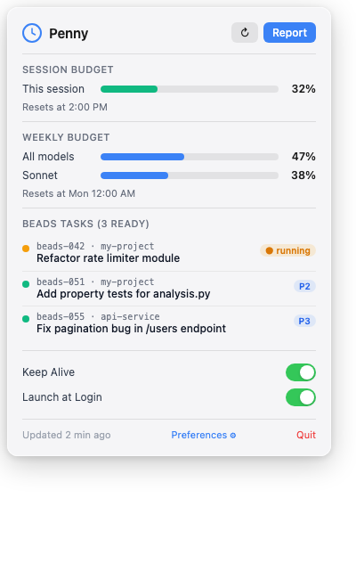
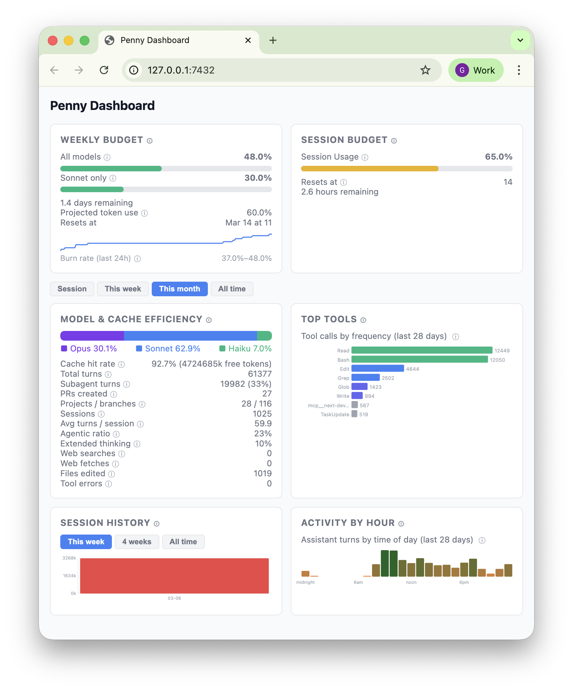

# Penny 

macOS menu bar app that monitors your Claude Code token usage, tracks session and weekly budgets, and surfaces detailed analytics to help you stay within your plan limits.

## Screenshots

| Menubar icon | Popover | Dashboard |
|:---:|:---:|:---:|
|  |  |  |
| Usage level in the menu bar | Session and weekly budget tracking | Live analytics dashboard |

---

## Resources

- [CHANGELOG](CHANGELOG.md) — version history
- [Security Policy](SECURITY.md) — data privacy and vulnerability reporting
- [Contributing](CONTRIBUTING.md) — dev setup and PR process
- [Architecture](docs/ARCHITECTURE.md) — system design and module map
- [API Reference](docs/API.md) — dashboard HTTP API for scripting

---

## What it does

1. **Token monitoring** — reads Claude Code session files and displays current session + weekly usage in the menu bar.
2. **Budget tracking** — All Models and Sonnet usage with progress bars and reset countdowns for both session and weekly billing periods.
3. **Capacity prediction** — projected usage at current burn rate, estimated remaining time, and unused capacity percentage.
4. **Health alerts** — budget projection warnings when you're on track to exceed your weekly limit, sustained anomaly detection for runaway processes, and error rate monitoring. Alerts appear in the menu bar and dashboard.
5. **Per-project analytics** — token usage breakdown by project with per-session drill-down, sortable columns, and session titles.
6. **Analytics dashboard** — live at `127.0.0.1:7432` with model breakdown, cache efficiency, tool usage, session history, activity by hour, and project-level metrics. All time-scoped cards share a global time window selector.
7. **HTML report** — self-contained status report with weekly usage history.

## Who it's for

Claude Pro or Max subscribers who use Claude Code and want visibility into how much of their weekly token budget they're actually using.

---

## Requirements

| Requirement | Notes |
|---|---|
| macOS 12+ | Menu bar requires macOS |
| Python 3.9+ | `python3 --version` to check |
| `claude` CLI (authenticated) | `npm install -g @anthropic-ai/claude-code` |
| Claude Pro or Max subscription | Required for the usage stats this app reads |

---

## Installation

### Prerequisites

1. **Install the claude CLI**
   ```bash
   npm install -g @anthropic-ai/claude-code
   ```

2. **Authenticate with Anthropic**
   ```bash
   claude auth login
   ```

### Install

```bash
curl -fsSL https://raw.githubusercontent.com/gpxl/penny/main/install.sh | bash
```

The installer clones the repo to `~/.penny/src`, installs Python dependencies, compiles the native launcher, registers the launchd service, and starts Penny automatically.

You can also install from a local clone:

```bash
git clone https://github.com/gpxl/penny.git
cd penny
bash install.sh
```

Once installed, Penny starts monitoring immediately — it reads `~/.claude/stats-cache.json` directly, so no manual configuration is needed.

### What gets installed

| Item | Location |
|---|---|
| Source code | `~/.penny/src/` (curl install) or your clone directory |
| User config | `~/.penny/config.yaml` |
| Runtime data | `~/.penny/state.json`, `~/.penny/logs/`, `~/.penny/reports/` |
| launchd plist | `~/Library/LaunchAgents/com.gpxl.penny.plist` |
| CLI symlink | `~/.local/bin/penny` |
| App bundle symlink | `~/Applications/Penny.app` |

---

## CLI commands

The `penny` CLI controls the service and provides quick access to data and config. After installation, it is available in your PATH.

### Service control

```bash
penny start          # Start Penny via launchd
penny stop           # Stop Penny (temporarily disables KeepAlive so launchd doesn't restart it)
penny restart        # Stop then start
penny quit           # Graceful quit (launchd may restart if KeepAlive is on)
penny status         # Show whether Penny is running or stopped
```

### Data and UI

```bash
penny refresh        # Trigger a live data refresh
penny open           # Open the analytics dashboard in your browser
penny logs           # Show the last 80 lines of the launchd log
penny logs -f        # Follow the log in real time
```

### Configuration

```bash
penny prefs          # Open config.yaml in your default editor
```

Changes to `config.yaml` are picked up automatically within 5 seconds — no restart needed.

### Version and help

```bash
penny version        # Show current version
penny -v             # Same as above
penny help           # Show all available commands
penny -h             # Same as above
```

---

## Updating

### Using the CLI

```bash
penny update
```

This runs `git pull --ff-only` in the source directory and re-runs `install.sh` to rebuild the launcher, update dependencies, and reload the launchd service. The version before and after is printed so you can confirm the update.

### Manual update

If you installed from a local clone:

```bash
cd /path/to/penny
git pull
bash install.sh
```

### Automatic update checks

Penny checks GitHub for new releases approximately once per day. When an update is available, a banner appears in the popover UI with **Update** and **Dismiss** buttons. A macOS notification is also sent. Dismissing hides the banner for that specific version.

---

## Config reference

Config file: `~/.penny/config.yaml` (or `$PENNY_HOME/config.yaml`)

| Key | Type | Default | Description |
|---|---|---|---|
| `stats_cache_path` | string | `~/.claude/stats-cache.json` | Path to Claude Code stats cache |
| `service.keep_alive` | bool | `true` | launchd restarts Penny if it exits |
| `service.launch_at_login` | bool | `true` | Penny starts when you log in |
| `notifications.weekly_summary` | bool | `true` | Weekly summary notification |

Additional keys for plugin-based agent automation (`projects`, `trigger`, `work`, `plugins`) exist in the config template but are inactive in the current release.

---

## Uninstalling

### Stop the service and remove the launchd registration

```bash
penny stop
launchctl bootout gui/$(id -u)/com.gpxl.penny
```

### Remove installed files

```bash
# launchd plist
rm ~/Library/LaunchAgents/com.gpxl.penny.plist

# CLI symlink
rm ~/.local/bin/penny

# App bundle symlink
rm ~/Applications/Penny.app
```

### Remove source code

```bash
# If installed via curl (source lives inside ~/.penny/src):
rm -rf ~/.penny/src

# If installed from a local clone, delete your clone directory:
rm -rf /path/to/penny
```

### Remove user data (optional)

This deletes config, state, logs, and reports:

```bash
rm -rf ~/.penny
```

---

## Troubleshooting

### Warning icon in menu bar / "Setup Required" alert

Open **Setup Issues…** from the menu to see a full list with fix hints. Common causes:

- `claude` not in launchd PATH — re-run `bash install.sh` after installing the CLI
- Authentication missing — run `claude auth login`

### Auth / "claude not authenticated" errors

```bash
claude auth login
claude --version   # should exit 0
```

### Config changes not taking effect

Changes to `config.yaml` are picked up automatically within 5 seconds via hot-reload. No restart needed.

### Penny won't start after stopping

If `penny start` doesn't bring it back, you can also launch via Spotlight or Finder:

- Open `~/Applications/Penny.app`
- Or search for "Penny" in Spotlight

### Viewing logs

```bash
penny logs -f
# or directly:
tail -f ~/.penny/logs/launchd.log
```

---

## Architecture

| Module | Purpose |
|---|---|
| `penny/app.py` | PyObjC/AppKit app, menus, timers, orchestration |
| `penny/analysis.py` | Stats parsing, budget estimation, capacity prediction |
| `penny/dashboard.py` | Local HTTP server at 127.0.0.1:7432 |
| `penny/status_fetcher.py` | Reads Claude Code stats-cache.json |
| `penny/report.py` | Self-contained HTML report with SVG usage chart |
| `penny/popover_vc.py` | Programmatic NSStackView UI — no NIB |
| `penny/state.py` | JSON state persistence (`$PENNY_HOME/state.json`) |
| `penny/paths.py` | Resolves `PENNY_HOME` env var → `~/.penny/` |
| `penny/bg_worker.py` | Background thread for off-main-thread data fetching |

### Timers

| Interval | What runs |
|---|---|
| Every 5 min | Background worker — reads stats, updates UI |
| Every 5 sec | Config watcher — checks mtime, hot-reloads changes |

---

## Security

Penny runs entirely on your machine. It reads Claude Code session files locally and never transmits data externally. The dashboard binds to localhost only. See [SECURITY.md](SECURITY.md) for details.
