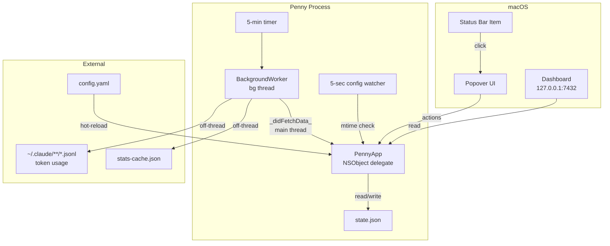
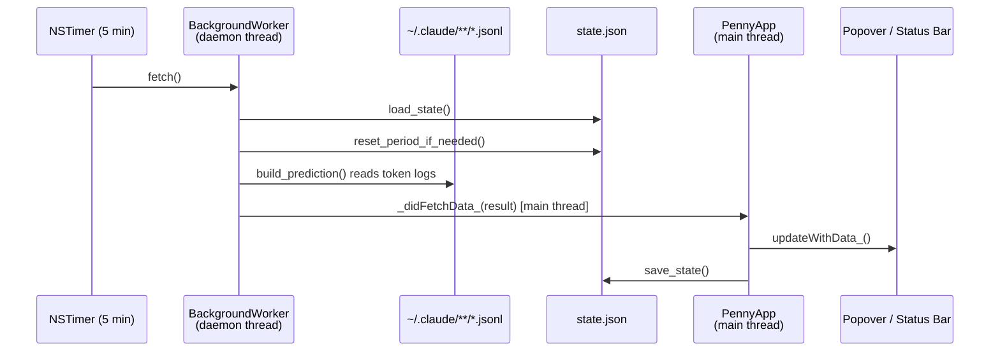

# Penny — Architecture

Penny is a macOS menu bar app (PyObjC, no RUMPS) that monitors Claude Code token usage and provides session/weekly budget tracking with a live analytics dashboard.

---

## Table of Contents

1. [System Overview](#system-overview)
2. [Module Map](#module-map)
3. [Core Loop](#core-loop)
4. [Config Hot-Reload](#config-hot-reload)
5. [State Schema](#state-schema)

---

## System Overview



---

## Module Map

| Module | Responsibility |
|--------|---------------|
| `app.py` | `PennyApp` NSObject delegate — status bar, popover, timers, orchestration, `_didFetchData_` main-thread callback |
| `bg_worker.py` | `BackgroundWorker` — runs `_fetch_data` on a daemon thread, posts result to main thread |
| `analysis.py` | Reads `*.jsonl` token logs, builds `Prediction` dataclass, capacity math |
| `dashboard.py` | `DashboardServer` — local HTTP server, `_snapshot()` JSON serialisation, embedded HTML/JS dashboard |
| `report.py` | Generates self-contained HTML report with SVG usage history chart |
| `status_fetcher.py` | Reads and parses `stats-cache.json` for current usage data |
| `state.py` | JSON persistence (`~/.penny/state.json`), period reset, session archiving |
| `popover_vc.py` | Programmatic `NSStackView` UI — no NIB, pure PyObjC |
| `onboarding.py` | First-run dialog |
| `paths.py` | Resolves `PENNY_HOME` env var → `~/.penny/` |
| `preflight.py` | Startup validation: `claude`, config paths, stats cache |

> Plugin infrastructure exists in the codebase for future use (see `penny/plugin.py`, `penny/plugins/`, and the `feature/beads-plugin` branch).

---

## Core Loop

Every 5 minutes an `NSTimer` fires `_timerFired_`, which triggers the background worker:



---

## Config Hot-Reload

A second `NSTimer` fires every 5 seconds and calls `_checkConfig_`. It does a single `stat()` syscall on `config.yaml`. On mtime change, `_hot_reload_config` re-parses the file and applies changes without a restart.

---

## State Schema

`~/.penny/state.json` is the single source of persistent runtime state. It is read at startup and written atomically (via `.tmp` rename) after any mutation.

```
state.json
├── last_check              string | null   — ISO timestamp of last stats fetch
├── current_period_start    string | null   — ISO timestamp of billing period start
├── predictions             object          — latest Prediction fields (pct_all, etc.)
├── period_history          array           — archived billing periods (last 12)
│   └── {period_start, output_all, output_sonnet}
├── session_history         array           — archived sub-sessions (last 200)
│   └── {start, end, output_all, output_sonnet}
├── last_session_scan       string | null   — ISO timestamp of last session archive scan
├── rich_metrics            object          — detailed model/cache/tool metrics
└── plugin_state            object          — plugin-owned state, namespaced by plugin name
                                              (empty when no plugins active)
```

### Core state keys

| Key | Owner | Reset on period rollover |
|-----|-------|--------------------------|
| `predictions` | Core | Yes — recalculated each cycle |
| `period_history` | Core | Appended, not cleared |
| `session_history` | Core | Appended, capped at 200 |
| `rich_metrics` | Core | Yes — recalculated each cycle |
| `plugin_state.*` | Each plugin | Never — plugins manage their own lifecycle |
