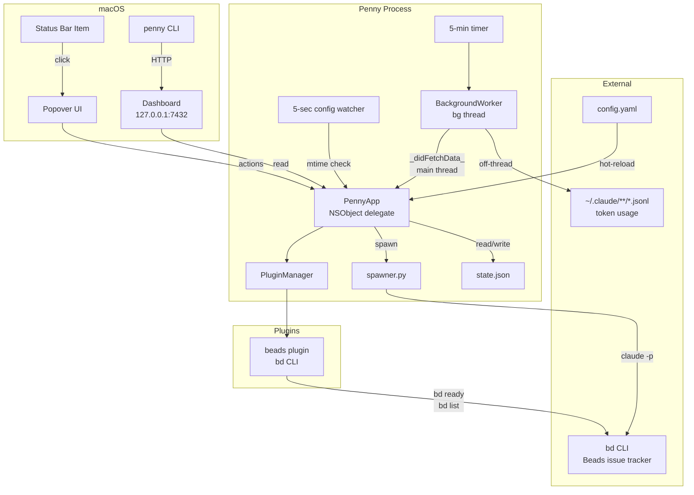
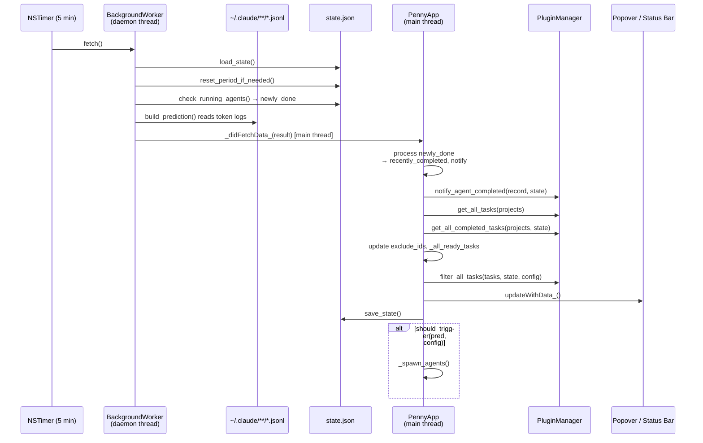
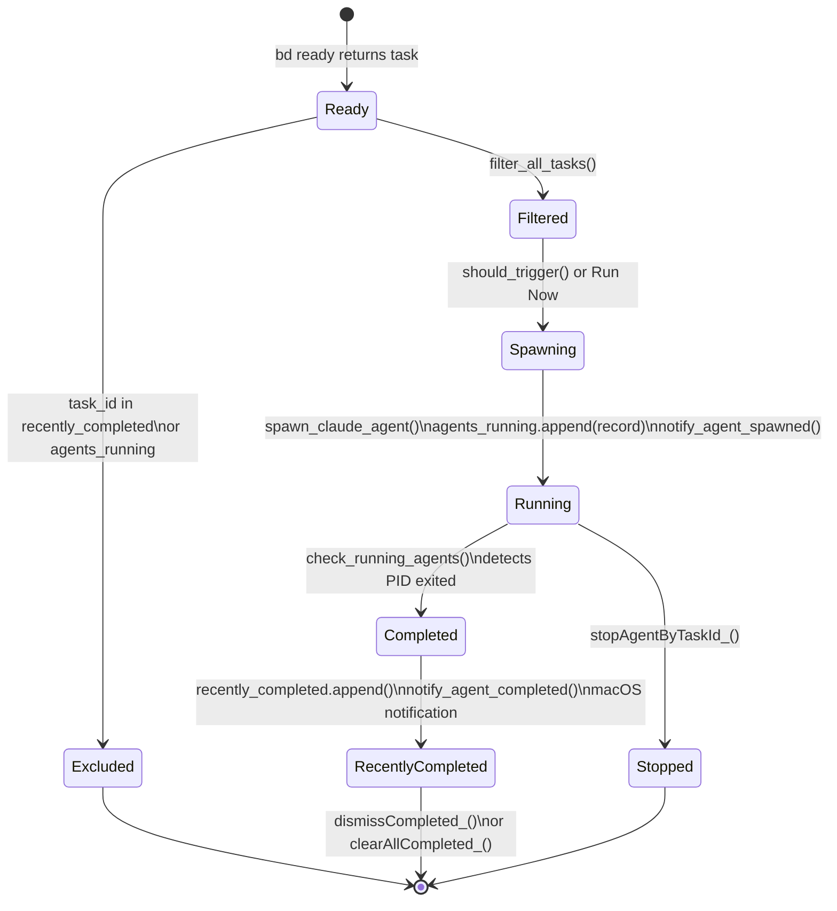
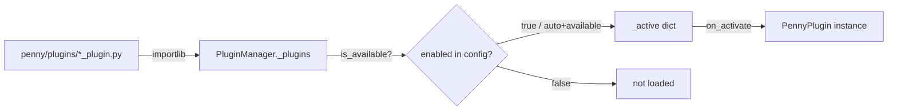
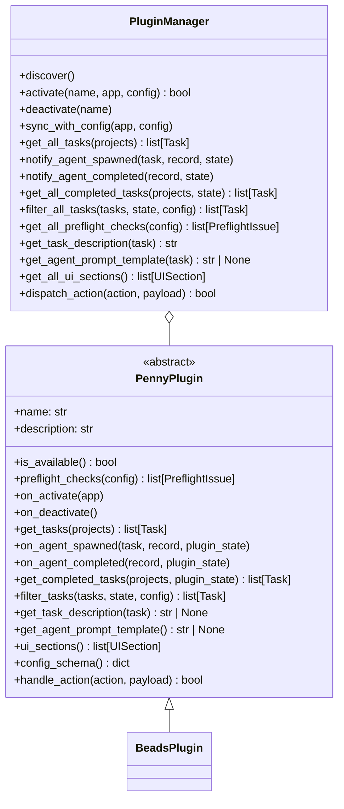
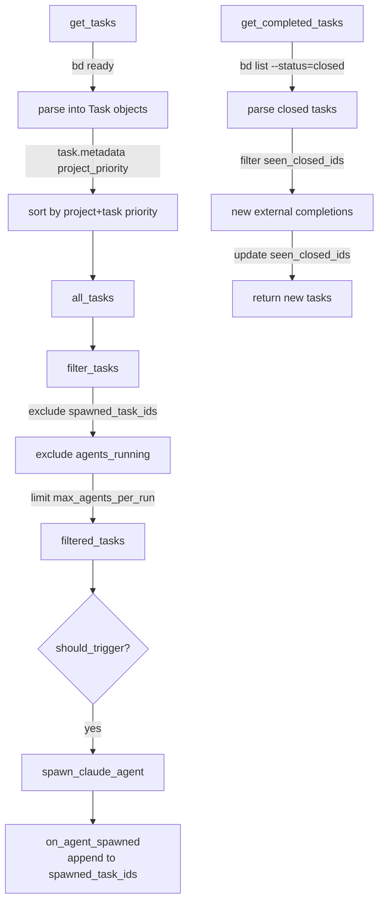

# Penny — Architecture

Penny is a macOS menu bar app (PyObjC, no RUMPS) that monitors Claude Max token usage and autonomously spawns Claude Code agents on tasks when weekly capacity would otherwise go unused.

---

## Table of Contents

1. [System Overview](#system-overview)
2. [Module Map](#module-map)
3. [Core Loop](#core-loop)
4. [Agent Lifecycle](#agent-lifecycle)
5. [Plugin System](#plugin-system)
6. [State Schema](#state-schema)
7. [Writing a Plugin](#writing-a-plugin)

---

## System Overview



---

## Module Map

| Module | Responsibility |
|--------|---------------|
| `app.py` | `PennyApp` NSObject delegate — status bar, popover, timers, orchestration, `_didFetchData_` main-thread callback |
| `bg_worker.py` | `BackgroundWorker` — runs `_fetch_data` on a daemon thread, posts result to main thread |
| `analysis.py` | Reads `*.jsonl` token logs, builds `Prediction` dataclass, capacity math |
| `spawner.py` | Builds Claude CLI invocations, launches agents in tmux/screen, monitors running PIDs |
| `plugin.py` | `PennyPlugin` ABC + `PluginManager` registry — discover, activate, dispatch |
| `state.py` | JSON persistence (`~/.penny/state.json`), period reset, session archiving |
| `dashboard.py` | `DashboardServer` — local HTTP server, `_snapshot()` JSON serialisation |
| `report.py` | Generates self-contained HTML report with SVG usage history chart |
| `preflight.py` | Startup validation: `claude`, `bd`, config paths, stats cache |
| `paths.py` | Resolves `PENNY_HOME` env var → `~/.penny/` |
| `tasks.py` | `Task` dataclass used across core and all plugins |
| `onboarding.py` | First-run dialog that writes initial `config.yaml` |
| `popover_vc.py` | Programmatic `NSStackView` UI — no NIB, pure PyObjC |
| `plugins/beads_plugin.py` | Beads integration: task discovery, filtering, completion tracking |

---

## Core Loop

Every 5 minutes a `NSTimer` fires `_timerFired_`, which triggers the background worker. The full fetch cycle is:



### Trigger condition

Agents are spawned automatically when **both** thresholds are met:

```
predicted_unused_capacity >= trigger.min_capacity_percent   (default 30%)
days_remaining_in_week    <= trigger.max_days_remaining     (default 2)
```

Override manually with **Run Now** in the popover or `penny run <id>` via CLI.

### Config hot-reload

A second `NSTimer` fires every 5 seconds and calls `_checkConfig_`. It does a single `stat()` syscall on `config.yaml`. On mtime change, `_hot_reload_config` re-parses the file and calls `plugin_mgr.sync_with_config()` to activate or deactivate plugins without a restart.

---

## Agent Lifecycle



### Spawn path

`spawner.spawn_claude_agent(task, description, interactive, prompt_template, config)`:

1. Renders the prompt template with task fields + full description from `get_task_description`.
2. Writes prompt to a temporary file with `0o600` permissions.
3. Launches `claude [permission flags] -p @<prompt_file>` inside a tmux session (falling back to screen, then bare process).
4. Returns an **agent record** dict that is appended to `state["agents_running"]`.

`spawner.check_running_agents(state)` is called on every background cycle. It checks each PID in `agents_running`; when a process is gone it removes it from `agents_running` and returns it in the `newly_done` list.

---

## Plugin System

Penny uses a two-class plugin architecture: **`PennyPlugin`** (ABC the plugin implements) and **`PluginManager`** (discovers, activates, and dispatches to plugins).

### Responsibility split

| Concern | Owner |
|---------|-------|
| Budget monitoring | Core |
| Service lifecycle (launchd) | Core |
| `agents_running` process tracking | Core |
| `recently_completed` (last-20 notification history) | Core |
| Budget UI sections | Core |
| Task discovery | Plugin |
| Task filtering and deduplication | Plugin |
| Completion detection (external) | Plugin |
| Agent lifecycle callbacks | Plugin |
| Plugin-owned persistent state | Plugin (via `plugin_state`) |

### Discovery and activation



`PluginManager.discover()` scans `penny/plugins/` for files matching `*_plugin.py` and imports any that expose a `Plugin` class inheriting from `PennyPlugin`. Activation is controlled by `config.yaml`:

```yaml
plugins:
  beads:
    enabled: auto   # auto | true | false
```

`auto` calls `plugin.is_available()` — the beads plugin returns `True` only when `bd` is in PATH.

### Plugin protocol



### `plugin_state` — plugin-owned persistence

Every plugin gets a namespaced sub-dict inside `state["plugin_state"][plugin.name]`. Core:

- **Never reads** `plugin_state` itself.
- **Never resets** `plugin_state` on billing-period rollover.
- **Persists** any mutations made during `on_agent_spawned`, `on_agent_completed`, and `get_completed_tasks` to `state.json` after each dispatch.

Each dispatcher extracts the plugin's namespace before calling:

```python
plugin_state = state.setdefault("plugin_state", {}).setdefault(plugin.name, {})
plugin.on_agent_spawned(task, record, plugin_state)
# mutations to plugin_state are automatically persisted
```

### Beads plugin

`penny/plugins/beads_plugin.py` is the reference plugin and the only built-in one.

| Method | What it does |
|--------|-------------|
| `is_available()` | Returns `shutil.which("bd") is not None` |
| `get_tasks(projects)` | Runs `bd ready` in each project dir, parses output into `Task` objects, stores project priority in `task.metadata["project_priority"]`, sorts by (project_priority, task_priority) |
| `on_agent_spawned(task, record, plugin_state)` | Appends `task.task_id` to `plugin_state["spawned_task_ids"]` |
| `filter_tasks(tasks, state, config)` | Excludes IDs in `plugin_state["beads"]["spawned_task_ids"]` and `agents_running`; enforces `max_agents_per_run` and `task_priority_levels` |
| `get_completed_tasks(projects, plugin_state)` | Runs `bd list --status=closed` per project; returns only IDs **not** in `plugin_state["seen_closed_ids"]`; updates `seen_closed_ids` before returning |
| `get_task_description(task)` | Runs `bd show <task_id>` and returns full markdown output |
| `get_agent_prompt_template()` | Returns the beads-specific prompt that instructs the agent to `bd prime`, `bd update in_progress`, work on a branch, open a PR, then `bd close` |



---

## State Schema

`~/.penny/state.json` is the single source of persistent runtime state. It is read at startup and written atomically (via `.tmp` rename) after any mutation.

```
state.json
├── last_check              string | null   — ISO timestamp of last /status fetch
├── current_period_start    string | null   — ISO timestamp of billing period start
├── predictions             object          — latest Prediction fields (pct_all, etc.)
├── agents_running          array           — agent records for processes currently alive
│   └── {task_id, project, project_path, title, priority,
│         status, pid, session, tmux_bin, log, spawned_at, interactive}
├── recently_completed      array           — last 20 completed agent records (core-managed)
│   └── same shape as agents_running + {status: "completed"|"unknown", completed_by?}
├── period_history          array           — archived billing periods (last 12)
│   └── {period_start, output_all, output_sonnet}
├── session_history         array           — archived sub-sessions (last 200)
│   └── {start, end, output_all, output_sonnet}
├── last_session_scan       string | null   — ISO timestamp of last session archive scan
└── plugin_state            object          — plugin-owned state, namespaced by plugin name
    └── beads
        ├── spawned_task_ids    array[string]   — task IDs that an agent was spawned for
        └── seen_closed_ids     array[string]   — task IDs already reported as externally closed
```

### Core vs plugin ownership

| Key | Owner | Reset on period rollover |
|-----|-------|--------------------------|
| `agents_running` | Core | Yes — cleared (stale PIDs) |
| `recently_completed` | Core | No — user-clearable via UI |
| `period_history` | Core | Appended, not cleared |
| `session_history` | Core | Appended, capped at 200 |
| `plugin_state.*` | Each plugin | **Never** — plugins manage their own lifecycle |

### Why `recently_completed` instead of `spawned_this_week`

Prior to this refactor, `spawned_this_week` served two purposes: deduplication (don't re-spawn a task) and display (the "Completed" panel). These concerns now live in their proper owners:

- **Deduplication** → `plugin_state["beads"]["spawned_task_ids"]` (plugin concern).
- **Display** → `recently_completed` (core concern; last 20, user-dismissable).

Tasks closed in Beads also won't reappear in `bd ready`, so the week-long dedup window was redundant.

---

## Writing a Plugin

### 1. Create the file

```
penny/plugins/myplugin_plugin.py
```

The filename must match `*_plugin.py`. The module must expose a `Plugin` class that inherits `PennyPlugin`.

### 2. Implement the required interface

```python
from penny.plugin import PennyPlugin, UISection
from penny.tasks import Task
from typing import Any

class Plugin(PennyPlugin):
    @property
    def name(self) -> str:
        return "myplugin"   # must be unique; used as plugin_state key

    @property
    def description(self) -> str:
        return "My custom task source"

    def is_available(self) -> bool:
        # Return False to silently skip activation when dependencies are absent
        import shutil
        return shutil.which("mytool") is not None

    # ── Task supply ──────────────────────────────────────────────────────

    def get_tasks(self, projects: list[dict[str, Any]]) -> list[Task]:
        """Return all available tasks across configured projects."""
        tasks = []
        for p in projects:
            # fetch tasks from your source
            tasks.append(Task(
                task_id="mp-001",
                title="Example task",
                priority="P2",
                project_path=p["path"],
                project_name=p["path"].split("/")[-1],
                metadata={"project_priority": p.get("priority", 99)},
            ))
        return tasks

    def filter_tasks(
        self, tasks: list[Task], state: dict[str, Any], config: dict[str, Any]
    ) -> list[Task]:
        """Remove tasks that should not be spawned this cycle."""
        ps = state.get("plugin_state", {}).get(self.name, {})
        already_spawned = set(ps.get("spawned_task_ids", []))
        running = {a["task_id"] for a in state.get("agents_running", [])}
        skip = already_spawned | running
        return [t for t in tasks if t.task_id not in skip]

    # ── Agent lifecycle hooks ────────────────────────────────────────────

    def on_agent_spawned(
        self, task: Task, record: dict[str, Any], plugin_state: dict[str, Any]
    ) -> None:
        """Record that we spawned this task so filter_tasks excludes it."""
        plugin_state.setdefault("spawned_task_ids", []).append(task.task_id)

    def on_agent_completed(
        self, record: dict[str, Any], plugin_state: dict[str, Any]
    ) -> None:
        """Called when core detects the agent process has exited."""
        # e.g. update your task tracker to mark the task done
        pass

    def get_completed_tasks(
        self, projects: list[dict[str, Any]], plugin_state: dict[str, Any]
    ) -> list[Task]:
        """Return ONLY tasks newly seen as externally closed.

        Update plugin_state["seen_closed_ids"] so the same tasks are never
        returned twice — core will persist plugin_state after this call.
        """
        seen = set(plugin_state.get("seen_closed_ids", []))
        new_tasks = []
        for p in projects:
            for closed_task in self._fetch_closed(p):
                if closed_task.task_id not in seen:
                    new_tasks.append(closed_task)
                    seen.add(closed_task.task_id)
        plugin_state["seen_closed_ids"] = list(seen)
        return new_tasks

    def _fetch_closed(self, project):
        return []  # implement for your task source

    # ── Optional: prompt, description, UI ───────────────────────────────

    def get_task_description(self, task: Task) -> str | None:
        """Return full task description for the agent prompt. None = not handled."""
        return None

    def get_agent_prompt_template(self) -> str | None:
        """Return a custom prompt template, or None to use the default."""
        return None

    def ui_sections(self) -> list[UISection]:
        """Contribute sections to the popover UI."""
        return []
```

### 3. Enable in config

```yaml
plugins:
  myplugin:
    enabled: auto   # or true / false
```

`auto` uses `is_available()`. No config entry defaults to `auto`.

### 4. Plugin state lifecycle

Your plugin's namespace inside `state["plugin_state"]["myplugin"]` is:

- **Created** on first access (empty dict).
- **Mutated** in your callbacks — mutations are visible to all subsequent calls in the same process.
- **Persisted** by core after each dispatcher call, without your plugin needing to call `save_state`.
- **Never reset** by core on billing-period rollover — your plugin controls its own cleanup.

### Key conventions

| Rule | Rationale |
|------|-----------|
| Use `task.metadata` for per-task plugin data | Avoids monkey-patching; `Task` is a frozen dataclass boundary |
| Only return **new** IDs from `get_completed_tasks` | Core appends each returned task to `recently_completed`; duplicates would show twice in UI |
| Never import from `app.py` | Plugins must not depend on the AppKit runtime; keep them pure-Python |
| Errors in any plugin method are caught by `PluginManager` | Exceptions are logged and the plugin is skipped for that call; other plugins continue |
